# animated_text_effects

A Flutter package for text with **66 composable animation effects** and **4 animated counter widgets**. Combine effects freely, control playback, and persist state across scroll off-screen.

<p align="center">
  
</p>
<p align="center">
  
  
  
</p>

---

## ✨ Features

- **66 effects** — fade, wave, typewriter, fire, smoke, matrix rain, glitch, scramble, shake, tracking, glow reveal, kinetic type, split reveal, ink drops, chromatic aberration, pixelate, water ripple, vortex, cascade, origami, shatter, morph, curtain, stomp, typewriter error, typewriter delete, falling leaves, fireflies, breath, circular reveal, scan lines, bar wake, weight, countdown, and more
- **Composable** — apply multiple effects simultaneously (opacity multiplies, translation sums, last color wins)
- **Loop modes** — forward, ping-pong, or finite repeat counts
- **External controller** — `TextEffectController` for play/pause/stop/seek
- **Scroll persistence** — animations survive scrolling off-screen via `keepAlive` (default `true`)
- **Counter widgets** — `AnimatedCounter`, `AnimatedPercentage`, `AnimatedCurrency`, `AnimatedStatCard`, `RollingDigitCounter`
- **Sequence widgets** — `AnimatedTextSequence` for sequential multi-text playback, `AnimatedRichText` for mixing static & animated text inline
- **Interactive demos** — included in example app with real-time parameter controls

## 📋 Effects

### 📂 Entry & Reveal

### Fade

```dart
AnimatedText(
  'Hello World',
  effects: const [FadeEffect()],
  style: TextStyle(fontSize: 32),
)
```

<p align="center">
  
</p>

---

### Slide

```dart
AnimatedText(
  'Hello World',
  effects: const [SlideEffect()],
  style: TextStyle(fontSize: 32),
)
```

<p align="center">
  
</p>

---

### Blur

```dart
AnimatedText(
  'Hello World',
  effects: const [BlurEffect()],
  style: TextStyle(fontSize: 32),
)
```

<p align="center">
  
</p>

---

### Typewriter

```dart
AnimatedText(
  'Hello World',
  effects: const [TypewriterEffect()],
  style: TextStyle(fontSize: 32),
)
```

<p align="center">
  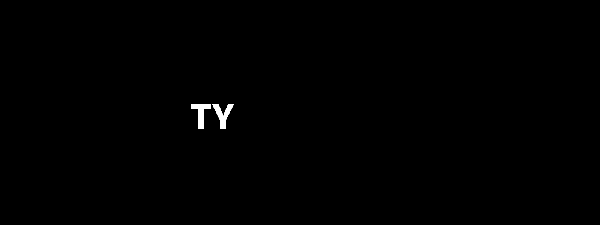
</p>

---

### Scatter

```dart
AnimatedText(
  'Hello World',
  effects: const [ScatterEffect()],
  style: TextStyle(fontSize: 32),
)
```

<p align="center">
  
</p>

---

### Staggered Appear

```dart
AnimatedText(
  'Hello World',
  effects: const [StaggeredAppearEffect()],
  style: TextStyle(fontSize: 32),
)
```

<p align="center">
  
</p>

---

### Random Reveal

```dart
AnimatedText(
  'Hello World',
  effects: const [RandomRevealEffect()],
  style: TextStyle(fontSize: 32),
)
```

<p align="center">
  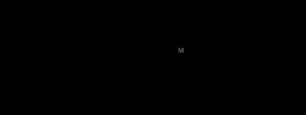
</p>

---

### Reveal

```dart
AnimatedText(
  'Hello World',
  effects: const [RevealEffect()],
  style: TextStyle(fontSize: 32),
)
```

<p align="center">
  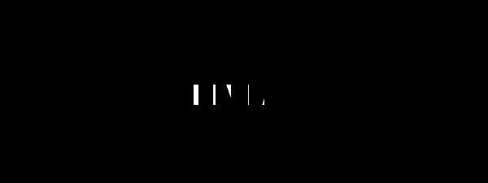
</p>

---

### Scramble

```dart
AnimatedText(
  'Hello World',
  effects: const [ScrambleEffect()],
  style: TextStyle(fontSize: 32),
)
```

<p align="center">
  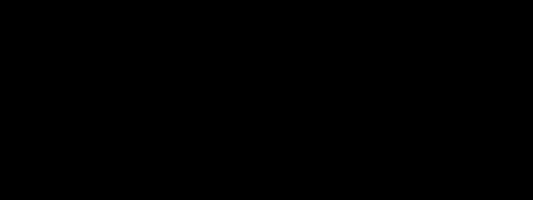
</p>

---

### Pop In

```dart
AnimatedText(
  'Hello World',
  effects: const [PopInEffect()],
  style: TextStyle(fontSize: 32),
)
```

<p align="center">
  
</p>

---

### Ripple

```dart
AnimatedText(
  'Hello World',
  effects: const [RippleEffect()],
  style: TextStyle(fontSize: 32),
)
```

<p align="center">
  
</p>

---

### Elastic

```dart
AnimatedText(
  'Hello World',
  effects: const [ElasticEffect()],
  style: TextStyle(fontSize: 32),
)
```

<p align="center">
  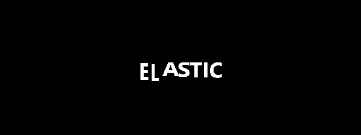
</p>

---


### 🎯 Motion & Energy

### Wave

```dart
AnimatedText(
  'Hello World',
  effects: const [WaveEffect()],
  style: TextStyle(fontSize: 32),
)
```

<p align="center">
  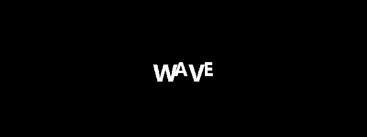
</p>

---

### Bounce

```dart
AnimatedText(
  'Hello World',
  effects: const [BounceEffect()],
  style: TextStyle(fontSize: 32),
)
```

<p align="center">
  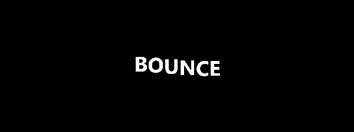
</p>

---

### Wiggle

```dart
AnimatedText(
  'Hello World',
  effects: const [WiggleEffect()],
  style: TextStyle(fontSize: 32),
)
```

<p align="center">
  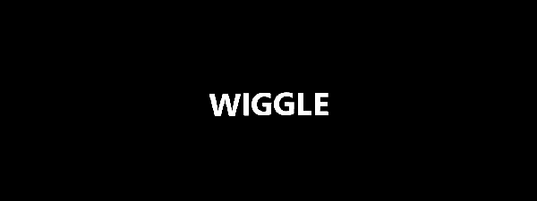
</p>

---

### Shake

```dart
AnimatedText(
  'Hello World',
  effects: const [ShakeEffect()],
  style: TextStyle(fontSize: 32),
)
```

<p align="center">
  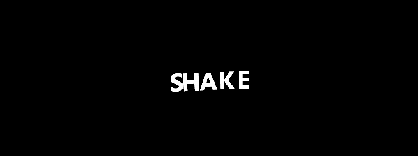
</p>

---

### Pulse

```dart
AnimatedText(
  'Hello World',
  effects: const [PulseEffect()],
  style: TextStyle(fontSize: 32),
)
```

<p align="center">
  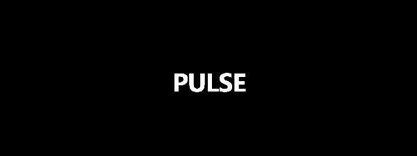
</p>

---

### Spin

```dart
AnimatedText(
  'Hello World',
  effects: const [SpinEffect()],
  style: TextStyle(fontSize: 32),
)
```

<p align="center">
  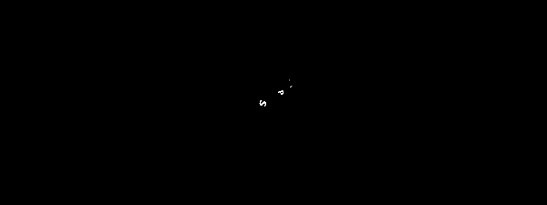
</p>

---

### Flip

```dart
AnimatedText(
  'Hello World',
  effects: const [FlipEffect()],
  style: TextStyle(fontSize: 32),
)
```

<p align="center">
  
</p>

---

### Flag Wave

```dart
AnimatedText(
  'Hello World',
  effects: const [FlagWaveEffect()],
  style: TextStyle(fontSize: 32),
)
```

<p align="center">
  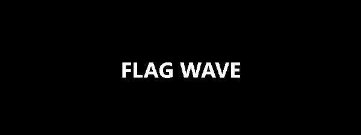
</p>

---

### Liquid

```dart
AnimatedText(
  'Hello World',
  effects: const [LiquidEffect()],
  style: TextStyle(fontSize: 32),
)
```

<p align="center">
  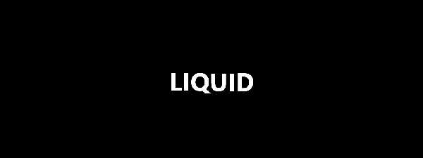
</p>

---

### Conveyor Belt

```dart
AnimatedText(
  'Hello World',
  effects: const [ConveyorBeltEffect()],
  style: TextStyle(fontSize: 32),
)
```

<p align="center">
  
</p>

---


### 🌈 Color & Light

### Gradient

```dart
AnimatedText(
  'Hello World',
  effects: const [GradientEffect()],
  style: TextStyle(fontSize: 32),
)
```

<p align="center">
  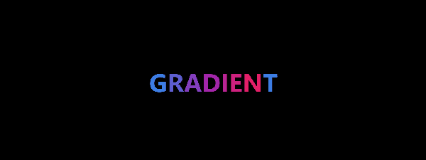
</p>

---

### Rainbow

```dart
AnimatedText(
  'Hello World',
  effects: const [RainbowEffect()],
  style: TextStyle(fontSize: 32),
)
```

<p align="center">
  
</p>

---

### Glow

```dart
AnimatedText(
  'Hello World',
  effects: const [GlowEffect()],
  style: TextStyle(fontSize: 32),
)
```

<p align="center">
  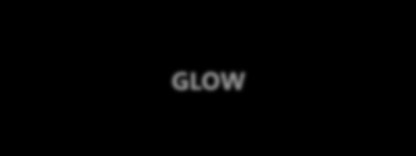
</p>

---

### Shimmer

```dart
AnimatedText(
  'Hello World',
  effects: const [ShimmerEffect()],
  style: TextStyle(fontSize: 32),
)
```

<p align="center">
  
</p>

---

### Wave Color

```dart
AnimatedText(
  'Hello World',
  effects: const [WaveColorEffect()],
  style: TextStyle(fontSize: 32),
)
```

<p align="center">
  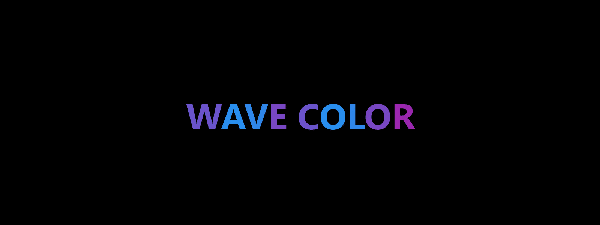
</p>

---

### Breathing Opacity

```dart
AnimatedText(
  'Hello World',
  effects: const [BreathingOpacityEffect()],
  style: TextStyle(fontSize: 32),
)
```

<p align="center">
  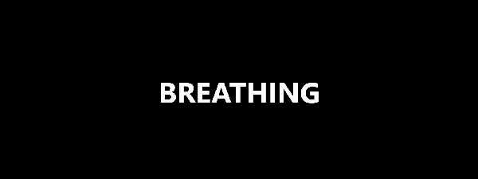
</p>

---

### Glow Reveal

```dart
AnimatedText(
  'Hello World',
  effects: const [GlowRevealEffect()],
  style: TextStyle(fontSize: 32),
)
```

<p align="center">
  
</p>

---

### Neon Flicker

```dart
AnimatedText(
  'Hello World',
  effects: const [NeonFlickerEffect()],
  style: TextStyle(fontSize: 32),
)
```

<p align="center">
  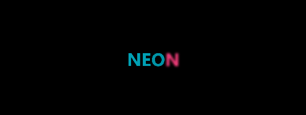
</p>

---

### Highlight

```dart
AnimatedText(
  'Hello World',
  effects: const [HighlightEffect()],
  style: TextStyle(fontSize: 32),
)
```

<p align="center">
  
</p>

---

### Sparkle Twinkle

```dart
AnimatedText(
  'Hello World',
  effects: const [SparkleTwinkleEffect()],
  style: TextStyle(fontSize: 32),
)
```

<p align="center">
  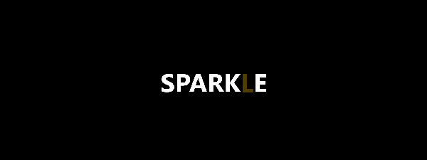
</p>

---

### Scanner

```dart
AnimatedText(
  'Hello World',
  effects: const [ScannerEffect()],
  style: TextStyle(fontSize: 32),
)
```

<p align="center">
  
</p>

---


### 💥 VFX & Distortion

### Fire

```dart
AnimatedText(
  'Hello World',
  effects: const [FireEffect()],
  style: TextStyle(fontSize: 32),
)
```

<p align="center">
  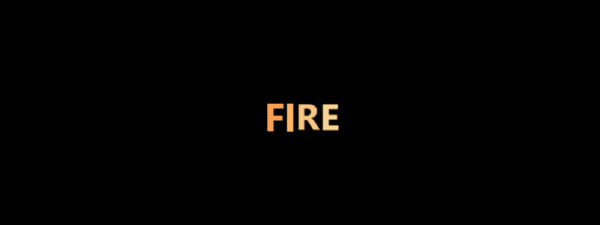
</p>

---

### Smoke

```dart
AnimatedText(
  'Hello World',
  effects: const [SmokeEffect()],
  style: TextStyle(fontSize: 32),
)
```

<p align="center">
  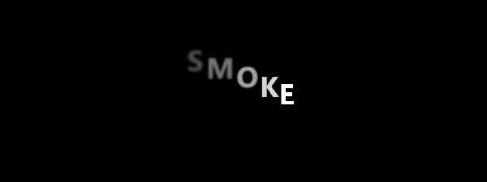
</p>

---

### VHS Glitch

```dart
AnimatedText(
  'Hello World',
  effects: const [VHSGlitchEffect()],
  style: TextStyle(fontSize: 32),
)
```

<p align="center">
  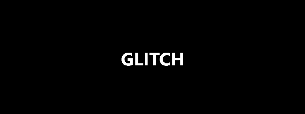
</p>

---

### Glitch Split

```dart
AnimatedText(
  'Hello World',
  effects: const [GlitchSplitEffect()],
  style: TextStyle(fontSize: 32),
)
```

<p align="center">
  
</p>

---

### Matrix Rain

```dart
AnimatedText(
  'Hello World',
  effects: const [MatrixRainEffect()],
  style: TextStyle(fontSize: 32),
)
```

<p align="center">
  
</p>

---

### Melt Drip

```dart
AnimatedText(
  'Hello World',
  effects: const [MeltDripEffect()],
  style: TextStyle(fontSize: 32),
)
```

<p align="center">
  
</p>

---

### Kinetic Type

```dart
AnimatedText(
  'Hello World',
  effects: const [KineticTypeEffect()],
  style: TextStyle(fontSize: 32),
)
```

<p align="center">
  
</p>

---

### Split Reveal

```dart
AnimatedText(
  'Hello World',
  effects: const [SplitRevealEffect()],
  style: TextStyle(fontSize: 32),
)
```

<p align="center">
  
</p>

---

### Ink Drops

```dart
AnimatedText(
  'Hello World',
  effects: const [InkDropsEffect()],
  style: TextStyle(fontSize: 32),
)
```

<p align="center">
  
</p>
---

### Chromatic Aberration

```dart
AnimatedText(
  'Hello World',
  effects: const [ChromaticAberrationEffect()],
  style: TextStyle(fontSize: 32),
)
```

<p align="center">
  
</p>

---

### Pixelate

```dart
AnimatedText(
  'Hello World',
  effects: const [PixelateEffect()],
  style: TextStyle(fontSize: 32),
)
```

<p align="center">
  
</p>

---

### Water Ripple

```dart
AnimatedText(
  'Hello World',
  effects: const [WaterRippleEffect()],
  style: TextStyle(fontSize: 32),
)
```

<p align="center">
  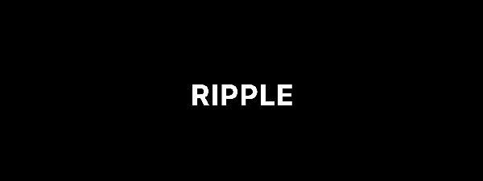
</p>

---

### Vortex

```dart
AnimatedText(
  'Hello World',
  effects: const [VortexEffect()],
  style: TextStyle(fontSize: 32),
)
```

<p align="center">
  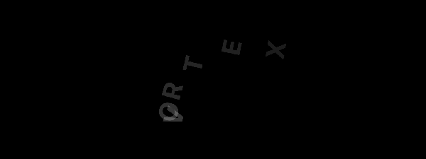
</p>

---

### Cascade

```dart
AnimatedText(
  'Hello World',
  effects: const [CascadeEffect()],
  style: TextStyle(fontSize: 32),
)
```

<p align="center">
  
</p>

---

### Origami

```dart
AnimatedText(
  'Hello World',
  effects: const [OrigamiEffect()],
  style: TextStyle(fontSize: 32),
)
```

<p align="center">
  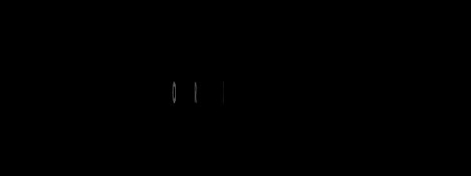
</p>

---

### Shatter

```dart
AnimatedText(
  'Hello World',
  effects: const [ShatterEffect()],
  style: TextStyle(fontSize: 32),
)
```

<p align="center">
  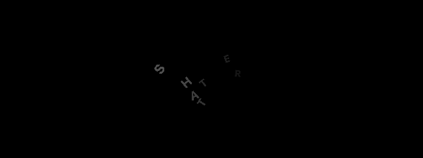
</p>

---

### Morph

```dart
AnimatedText(
  'Hello World',
  effects: const [MorphEffect()],
  style: TextStyle(fontSize: 32),
)
```

<p align="center">
  
</p>

---

### Curtain

```dart
AnimatedText(
  'Hello World',
  effects: const [CurtainEffect()],
  style: TextStyle(fontSize: 32),
)
```

<p align="center">
  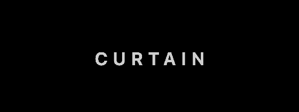
</p>

---

### Stomp

```dart
AnimatedText(
  'Hello World',
  effects: const [StompEffect()],
  style: TextStyle(fontSize: 32),
)
```

<p align="center">
  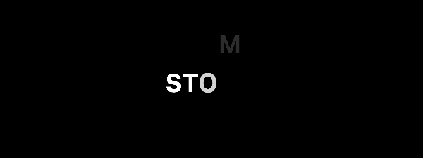
</p>

---

### Typewriter Error

```dart
AnimatedText(
  'Hello World',
  effects: const [TypewriterErrorEffect()],
  style: TextStyle(fontSize: 32),
)
```

<p align="center">
  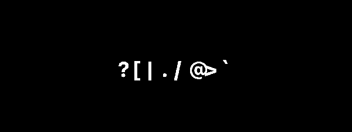
</p>

---

### Typewriter Delete

```dart
AnimatedText(
  'Hello World',
  effects: const [TypewriterDeleteEffect()],
  style: TextStyle(fontSize: 32),
)
```

<p align="center">
  
</p>

---

### Falling Leaves

```dart
AnimatedText(
  'Hello World',
  effects: const [FallingLeavesEffect()],
  style: TextStyle(fontSize: 32),
)
```

<p align="center">
  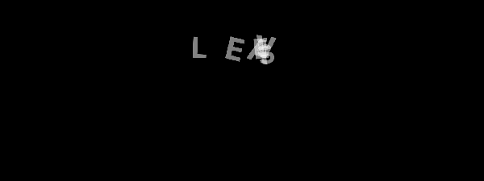
</p>

---

### Fireflies

```dart
AnimatedText(
  'Hello World',
  effects: const [FirefliesEffect()],
  style: TextStyle(fontSize: 32),
)
```

<p align="center">
  
</p>

---

### Breath

```dart
AnimatedText(
  'Hello World',
  effects: const [BreathEffect()],
  style: TextStyle(fontSize: 32),
)
```

<p align="center">
  
</p>

---

### Circular Reveal

```dart
AnimatedText(
  'Hello World',
  effects: const [CircularRevealEffect()],
  style: TextStyle(fontSize: 32),
)
```

<p align="center">
  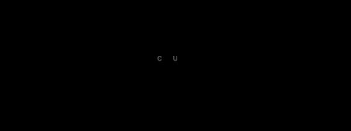
</p>

---

### Scan Lines

```dart
AnimatedText(
  'Hello World',
  effects: const [ScanLinesEffect()],
  style: TextStyle(fontSize: 32),
)
```

<p align="center">
  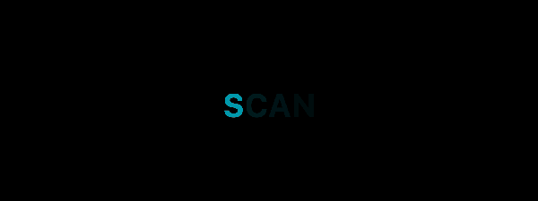
</p>

---

### Bar Wake

```dart
AnimatedText(
  'Hello World',
  effects: const [BarWakeEffect()],
  style: TextStyle(fontSize: 32),
)
```

<p align="center">
  
</p>

---

### Weight

```dart
AnimatedText(
  'Hello World',
  effects: const [WeightEffect()],
  style: TextStyle(fontSize: 32),
)
```

<p align="center">
  
</p>

---

### Countdown

```dart
AnimatedText(
  'Hello World',
  effects: const [CountdownEffect()],
  style: TextStyle(fontSize: 32),
)
```

<p align="center">
  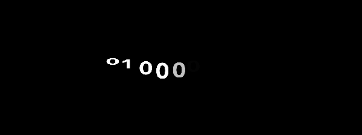
</p>

---

### 📏 Utility
### Progress Text

```dart
AnimatedText(
  'Hello World',
  effects: const [ProgressTextEffect()],
  style: TextStyle(fontSize: 32),
)
```

<p align="center">
  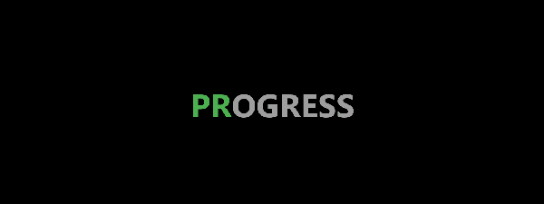
</p>

---

### Tracking

```dart
AnimatedText(
  'Hello World',
  effects: const [TrackingEffect()],
  style: TextStyle(fontSize: 32),
)
```

<p align="center">
  
</p>

---

### Underline

```dart
AnimatedText(
  'Hello World',
  effects: const [UnderlineEffect()],
  style: TextStyle(fontSize: 32),
)
```

<p align="center">
  
</p>

---


## 🔗 Sequence & Rich Text

### AnimatedTextSequence

```dart
AnimatedTextSequence(
  texts: [
    SequenceText('Hello', effects: const [FadeEffect()]),
    SequenceText('World', effects: const [WaveEffect()]),
    SequenceText('!', effects: const [BounceEffect()]),
  ],
  repeat: true,
  displayDuration: Duration(seconds: 2),
  transitionDuration: Duration(milliseconds: 600),
  style: TextStyle(fontSize: 28, fontWeight: FontWeight.bold),
)
```

<p align="center">
  
</p>

---

### AnimatedRichText

```dart
AnimatedRichText(
  segments: [
    TextSegment.static('Static '),
    TextSegment.animated('Animated!', effects: const [FadeEffect(), WaveEffect()]),
    TextSegment.static(' suffix'),
  ],
  repeat: true,
  style: TextStyle(fontSize: 28, fontWeight: FontWeight.bold),
)
```

<p align="center">
  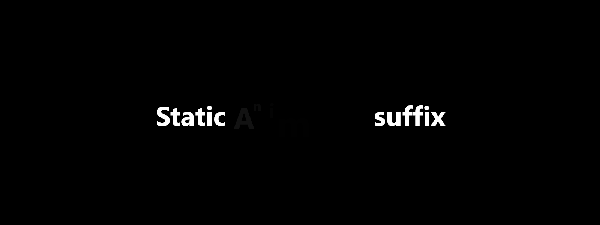
</p>

---

### AnimatedCounter

```dart
AnimatedCounter(
  value: 99999,
  duration: Duration(seconds: 3),
  style: TextStyle(fontSize: 48, fontWeight: FontWeight.bold),
)
```

<p align="center">
  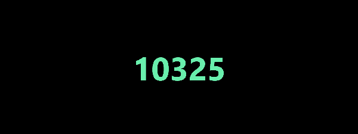
</p>

---

### AnimatedPercentage

```dart
AnimatedPercentage(
  value: 87.5,
  decimals: 1,
  style: TextStyle(fontSize: 48, fontWeight: FontWeight.bold),
)
```

<p align="center">
  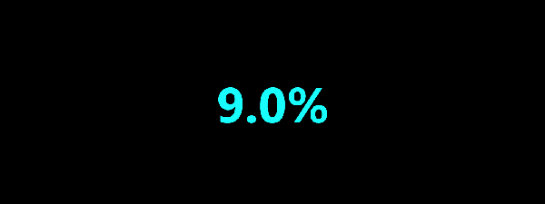
</p>

---

### AnimatedCurrency

```dart
AnimatedCurrency(
  value: 123456.78,
  decimals: 2,
  symbol: r'$',
  style: TextStyle(fontSize: 48, fontWeight: FontWeight.bold),
)
```

<p align="center">
  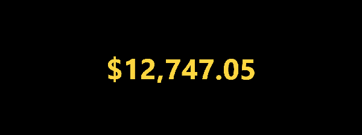
</p>

---

### RollingDigitCounter

```dart
RollingDigitCounter(
  value: 2026,
  style: TextStyle(fontSize: 48, fontWeight: FontWeight.bold),
)
```

<p align="center">
  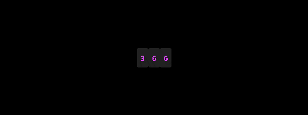
</p>

---

### AnimatedStatCard

```dart
AnimatedStatCard(
  value: 8472,
  label: 'Users',
  icon: Icons.people,
  activeColor: Colors.blue,
)
```

<p align="center">
  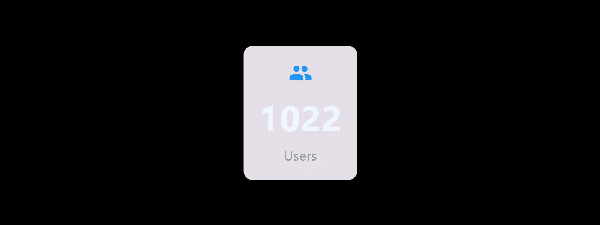
</p>

---

## 🚀 Getting started

### Import

```dart
import 'package:animated_text_effects/animated_text_effects.dart';
```

## 📟 Counter widgets reference

### AnimatedCounter

```dart
AnimatedCounter({
  required num value,
  Duration duration = 1000ms,
  Curve curve = easeOut,
  TextStyle? style,
  int decimals = 0,
  Color? activeColor,
  bool scalePulse = false,
  bool autoplay = true,
  bool keepAlive = true,
  String Function(num)? format,
})
```

### AnimatedPercentage

```dart
AnimatedPercentage({
  required num value,
  int decimals = 1,
  Duration duration = 1000ms,
  Curve curve = easeOut,
  TextStyle? style,
  bool autoplay = true,
  bool keepAlive = true,
  Color? activeColor,
  bool scalePulse = false,
  bool showPercentSign = true,
})
```

### AnimatedCurrency

```dart
AnimatedCurrency({
  required num value,
  int decimals = 2,
  String symbol = r'$',
  Duration duration = 1000ms,
  Curve curve = easeOut,
  TextStyle? style,
  bool autoplay = true,
  bool keepAlive = true,
  Color? activeColor,
  bool scalePulse = false,
  bool showPlusSign = false,
})
```

### AnimatedStatCard

```dart
AnimatedStatCard({
  required num value,
  required String label,
  IconData? icon,
  int decimals = 0,
  Duration duration = 1000ms,
  Curve curve = easeOut,
  TextStyle? valueStyle,
  TextStyle? labelStyle,
  Color? activeColor,
  bool scalePulse = false,
  Color? cardColor,
  double elevation = 2,
  EdgeInsetsGeometry padding = EdgeInsets.all(20),
  bool autoplay = true,
  String Function(num)? format,
})
```

### RollingDigitCounter

```dart
RollingDigitCounter({
  required num value,
  int decimals = 0,
  Duration duration = 1000ms,
  TextStyle? style,
  bool autoplay = true,
  bool keepAlive = true,
  double digitWidth = 28,
  double digitHeight = 40,
  Color? backgroundColor,
})
```

## 🧩 AnimatedText widget API

| Parameter | Type | Default | Description |
|---|---|---|---|
| `text` | `String` | — | Text to animate |
| `effects` | `List<TextEffect>` | `[]` | Effects to apply (order matters for color) |
| `controller` | `TextEffectController?` | `null` | External playback control |
| `style` | `TextStyle?` | inherits | Text styling |
| `autoplay` | `bool` | `true` | Start animation automatically |
| `repeat` | `bool` | `false` | Loop infinitely |
| `reverse` | `bool` | `false` | Ping-pong (requires `repeat: true`) |
| `textAlign` | `TextAlign` | `start` | Text alignment |
| `textDirection` | `TextDirection` | `ltr` | Text direction |
| `keepAlive` | `bool` | `true` | Persist animation in scroll views |

## 🧩 CharacterAnimation properties

| Property | Type | Combined as | Description |
|---|---|---|---|
| `opacity` | `double` | Multiplied | Character opacity |
| `translation` | `Offset` | Summed | Displacement from origin |
| `scale` | `double` | Multiplied | Uniform scale |
| `scaleX` | `double` | Multiplied | Horizontal scale |
| `scaleY` | `double` | Multiplied | Vertical scale |
| `color` | `Color?` | Last non-null wins | Text color |
| `backgroundColor` | `Color?` | Last non-null wins | Background behind character |
| `blurSigma` | `double` | Summed | Gaussian blur |
| `rotation` | `double` | Summed | 2D rotation (radians) |
| `rotationX` | `double` | Summed | 3D X rotation (radians) |
| `rotationY` | `double` | Summed | 3D Y rotation (radians) |
| `underlineProgress` | `double` | Summed | Underline fill (0–1) |
| `clipProgress` | `double` | Multiplied | Visible portion (0–1) |

## 🧪 Composing effects

| Property | Combination rule |
|---|---|
| `opacity` | **Multiplied** across effects |
| `translation` | **Summed** across effects |
| `scale`, `scaleX`, `scaleY` | **Multiplied** across effects |
| `color`, `backgroundColor` | **Last non-null** wins |
| `blurSigma`, `rotation`, `rotationX`, `rotationY`, `underlineProgress` | **Summed** across effects |
| `clipProgress` | **Multiplied** across effects |

## 🧩 Sequence widgets API

### AnimatedTextSequence

| Parameter | Type | Default | Description |
|---|---|---|---|
| `texts` | `List<SequenceText>` | — | Ordered list of text items to cycle through |
| `controller` | `TextEffectController?` | `null` | External playback control |
| `style` | `TextStyle?` | inherits | Text styling (applied to all texts) |
| `autoplay` | `bool` | `true` | Start animation automatically |
| `repeat` | `bool` | `true` | Loop infinitely through the sequence |
| `displayDuration` | `Duration` | `3s` | How long each text is displayed |
| `transitionDuration` | `Duration` | `500ms` | Duration of the cross-fade between texts |
| `transitionEffect` | `TextEffect?` | `null` | Effect applied during transitions (null = plain cross-fade) |
| `textAlign` | `TextAlign` | `start` | Text alignment |
| `textDirection` | `TextDirection` | `ltr` | Text direction |
| `keepAlive` | `bool` | `true` | Persist animation in scroll views |

### SequenceText

| Parameter | Type | Default | Description |
|---|---|---|---|
| `text` | `String` | — | Text content for this item |
| `effects` | `List<TextEffect>` | `[]` | Effects to apply when this text is displayed |
| `style` | `TextStyle?` | `null` | Per-item text style override |
| `segments` | `List<TextSegment>?` | `null` | Fine-grained segment control (for mixed static/animated within one item) |

### AnimatedRichText

| Parameter | Type | Default | Description |
|---|---|---|---|
| `segments` | `List<TextSegment>` | — | Ordered list of static or animated text segments |
| `controller` | `TextEffectController?` | `null` | External playback control |
| `style` | `TextStyle?` | inherits | Base text styling |
| `autoplay` | `bool` | `true` | Start animation automatically |
| `repeat` | `bool` | `false` | Loop infinitely |
| `reverse` | `bool` | `false` | Ping-pong (requires `repeat: true`) |
| `textAlign` | `TextAlign` | `start` | Text alignment |
| `textDirection` | `TextDirection` | `ltr` | Text direction |
| `keepAlive` | `bool` | `true` | Persist animation in scroll views |

### TextSegment

| Constructor | Parameters | Description |
|---|---|---|
| `TextSegment.static(text)` | `text` | Non-animated text segment |
| `TextSegment.animated(text, {effects})` | `text`, `effects` | Animated text segment with optional effects |

## 📐 Effect contract

All effects guarantee `f(0) == f(1)` — at `progress=0` and `progress=1` every character returns to its base state. This ensures seamless looping and predictable end states.

Noise-based effects (`FireEffect`, `NeonFlickerEffect`, `VHSGlitchEffect`, `WiggleEffect`, `SparkleTwinkleEffect`) wrap their output to enforce this contract.

Use `noise(int index, [int offset])` on `TextEffect` for deterministic pseudo-random values per character:

```dart
final value = noise(index);       // 0.0–1.0 per character
final value = noise(index, 42);   // with offset for different noise streams
```

## 🔄 Scroll persistence

Animations survive scrolling off-screen by default (`keepAlive: true`). This uses `AutomaticKeepAliveClientMixin` under the hood.

For more advanced persistence across widget mount/unmount (e.g., conditional rendering), use `TextEffectController` which saves its progress internally on detach and restores on attach:

```dart
class MyWidget extends StatefulWidget {
  @override
  State<MyWidget> createState() => _MyWidgetState();
}

class _MyWidgetState extends State<MyWidget> with SingleTickerProviderStateMixin {
  final controller = TextEffectController();

  @override
  void dispose() {
    controller.dispose();
    super.dispose();
  }

  @override
  Widget build(BuildContext context) {
    return Column(
      children: [
        if (showText)
          AnimatedText(
            'Persistent text',
            effects: const [FadeEffect(), WaveEffect()],
            controller: controller,
          ),
      ],
    );
  }
}
```

## 🎮 Interactive demos

The example app includes two interactive demos reachable from the AppBar:

- **Text** — multi-effect checkboxes with per-effect parameter sliders (all 45 effects)
- **Counters** — all 5 counter types with global controls (value, decimals, duration, curve, color, scale pulse) and a reset button that recreates all widgets from scratch
- **Sequence** — interactive `AnimatedTextSequence` with per-text effect selection and transition effect picker
- **Comprehensive** — tabbed demo (Static Text, Sequence, Mixed) with gap support, per-text effects, color, curve, and font size controls
- **Cmp Counters** — tabbed counter demo (Single, Dashboard, Mixed) with inline prefix/suffix text mixing

```bash
cd example
flutter run
```

## 🏗️ Architecture

```
lib/
├── animated_text_effects.dart    # Barrel exports
├── core/
│   ├── text_effect.dart          # Abstract base with noise() helper
│   ├── text_effect_controller.dart  # Playback controller with attach/detach
│   ├── character_animation.dart  # Per-character animation data
│   ├── animated_text.dart        # Main AnimatedText widget
│   ├── text_segment.dart         # Static or animated segment for AnimatedRichText
│   ├── sequence_text.dart        # Text item with effects for AnimatedTextSequence
│   ├── animated_rich_text.dart   # Inline static + animated text segments
│   ├── animated_text_sequence.dart  # Sequential multi-text playback with transitions
│   └── animated_counter.dart     # AnimatedCounter base widget
├── effects/                      # 45 effect implementations
│   ├── fade_effect.dart
│   ├── gradient_effect.dart
│   ├── wave_effect.dart
│   ├── typewriter_effect.dart
│   ├── bounce_effect.dart
│   ├── shimmer_effect.dart
│   ├── slide_effect.dart
│   ├── blur_effect.dart
│   ├── rainbow_effect.dart
│   ├── glow_effect.dart
│   ├── ripple_effect.dart
│   ├── spin_effect.dart
│   ├── flip_effect.dart
│   ├── wiggle_effect.dart
│   ├── pulse_effect.dart
│   ├── scatter_effect.dart
│   ├── neon_flicker_effect.dart
│   ├── elastic_effect.dart
│   ├── highlight_effect.dart
│   ├── underline_effect.dart
│   ├── progress_text_effect.dart
│   ├── staggered_appear_effect.dart
│   ├── fire_effect.dart
│   ├── smoke_effect.dart
│   ├── vhs_glitch_effect.dart
│   ├── reveal_effect.dart
│   ├── liquid_effect.dart
│   ├── scanner_effect.dart
│   ├── wave_color_effect.dart
│   ├── breathing_opacity_effect.dart
│   ├── conveyor_belt_effect.dart
│   ├── melt_drip_effect.dart
│   ├── sparkle_twinkle_effect.dart
│   ├── matrix_rain_effect.dart
│   ├── scramble_effect.dart
│   ├── pop_in_effect.dart
│   ├── shake_effect.dart
│   ├── flag_wave_effect.dart
│   ├── tracking_effect.dart
│   ├── glow_reveal_effect.dart
│   ├── kinetic_type_effect.dart
│   ├── split_reveal_effect.dart
│   ├── ink_drops_effect.dart
│   └── random_reveal_effect.dart
│   └── glitch_split_effect.dart
└── counters/                     # Counter widgets
    ├── animated_percentage.dart
    ├── animated_currency.dart
    ├── animated_stat_card.dart
    └── rolling_digit_counter.dart
```

## 📄 License

MIT
